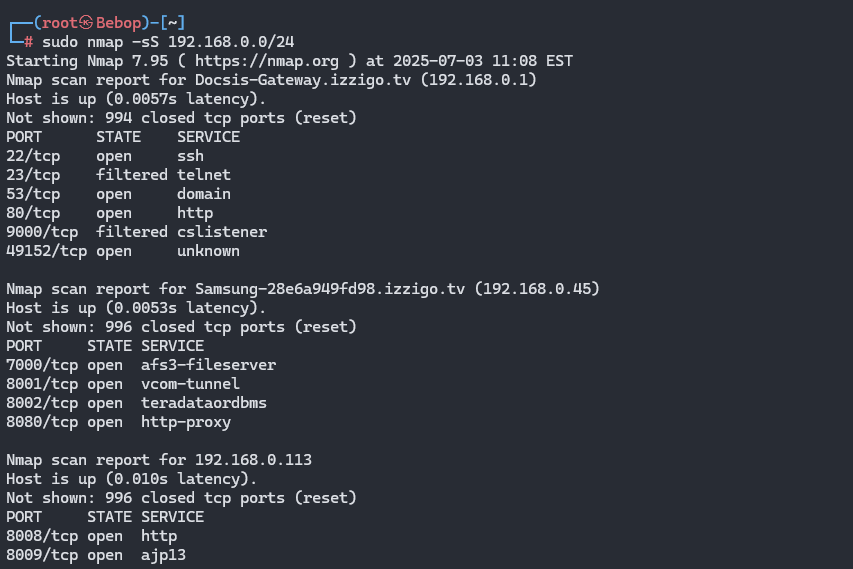
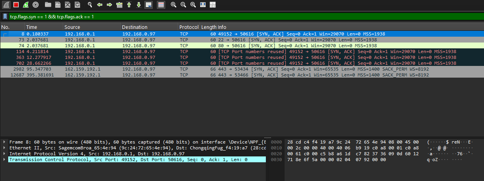
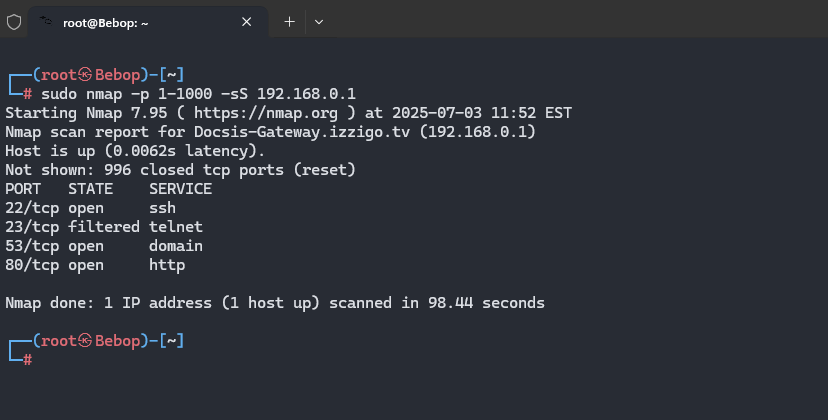
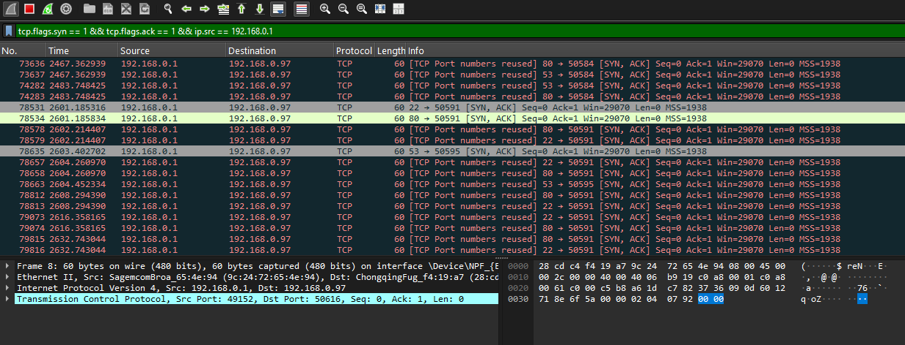
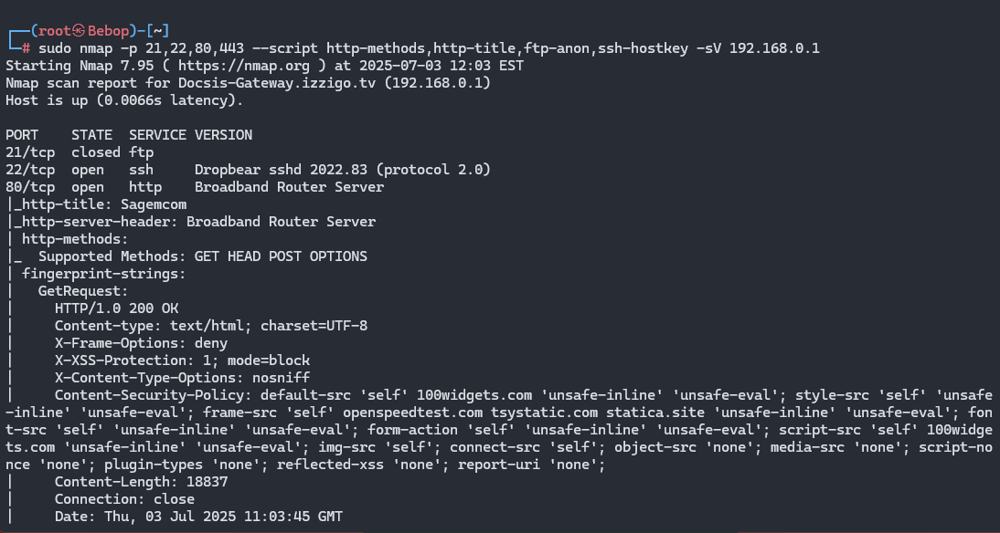
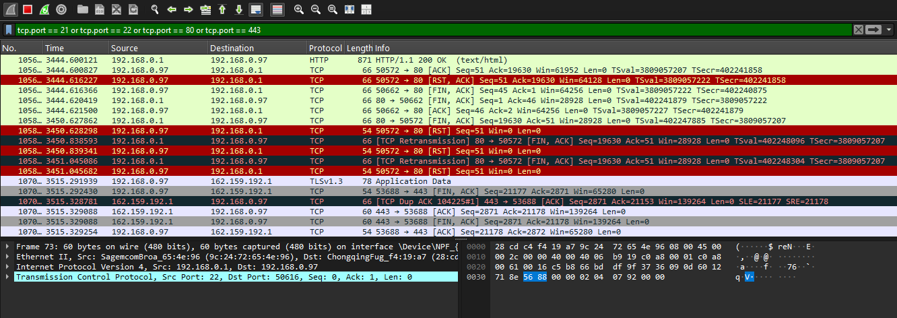
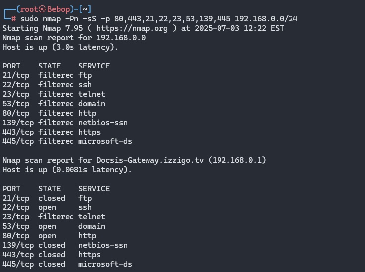
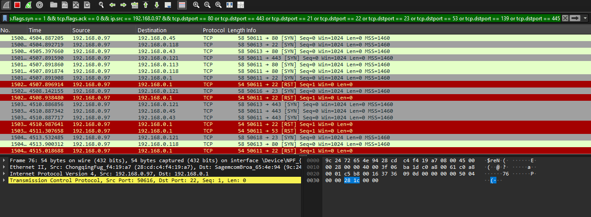

## Ejercicio 1: Mapeo completo de tu red local

Con base en tu segmento de red, realiza un escaneo que te permita identificar todos los hosts activos y los servicios que están corriendo en cada uno. Analiza qué equipos representan un posible riesgo por los servicios expuestos.
### En Wireshark deberían ver:

- Tráfico SYN enviado a múltiples IPs del segmento.
- Respuestas SYN-ACK desde los hosts activos.
- Tráfico ICMP si usan ping scan.
- Escaneos dirigidos a múltiples puertos por host.
### Evidencia
1. Escaneo de puertos con Nmap
Comando: `sudo nmap -sS 192.168.0.0/24`
Este comando realiza un escaneo SYN stealth para encontrar hosts activos con puertos abiertos

2. Captura de trafico con Wireshark
Filtro: `tcp.flags.syn == 1 && tcp.flags.ack == 1`
Este filtro busca hosts que tienen un puerto abierto, indicando que están listos para establecer una conexión, mediante paquetes TCP. (aunque Nmap ya te lo indica realmente)

## Ejercicio 2: Escaneo sigiloso a un host en tu red

Escoge un host dentro de tu red y realiza un escaneo que utilice técnicas de evasión para evitar su detección por firewalls o sistemas de monitoreo. Evalúa si lograste obtener información sin generar tráfico evidente.
### En Wireshark deberían ver:
- Tráfico con fragmentación de paquetes TCP/IP.
- Uso de un puerto fuente no estándar (ej. 53, 123).
- Intervalos largos entre los paquetes (bajo volumen).
- Tráfico que no completa handshakes TCP.
### Evidencia
1. Escaneo de puertos con Nmap
Comando: `sudo nmap -p 1-1000 -sS 192.168.0.1`
Este comando ejecuta un escaneo SYN stealth en los puertos TCP del 1 al 1000 para detectar puertos abiertos

2. Captura de datos con Wireshark
Filtro: `tcp.flags.syn == 1 && tcp.flags.ack == 1 && ip.src == 192.168.0.1`
Este filtro busca puertos abiertos al identificar respuestas SYN-ACK a través de paquetes TCP

## Ejercicio 3: Enumeración avanzada de servicios

Identifica un host dentro de tu red que tenga servicios web, FTP, o SSH, y utiliza técnicas avanzadas para obtener información detallada de esos servicios (como banners, versiones, métodos HTTP, etc.).
### En Wireshark deberían ver:
- Solicitudes hacia puertos 21, 22, 80, 443, u otros comunes.
- Tráfico con comandos FTP, HTTP o SSH.
- Respuestas con datos identificables: versiones de servicios, encabezados HTTP, mensajes de bienvenida de FTP/SSH.
### Evidencia
1. Escaneo de puertos con Nmap
Comando: `sudo nmap -p 21,22,80,443 --script http-methods,http-title,ftp-anon,ssh-hostkey -sV 192.168.0.1`
Este comando ejecuta un escaneo de detección de versiones de servici en los **puertos TCP 21, 22, 80 y 443** del host objetivo. Utiliza un script para realizar una enumeración profunda de los servicios expuestos.

2. Captura de datos con Wireshark
Filtro: `tcp.port == 21 or tcp.port == 22 or tcp.port == 80 or tcp.port == 443`
Este filtro te mostrará todo el tráfico TCP que involucre cualquiera de estos puertos.

## Ejercicio 4: Detección de hosts sin ICMP habilitado

Encuentra dentro de tu red aquellos hosts que no responden a ping (ICMP), pero que tienen puertos abiertos accesibles. Analiza si puedes detectarlos sin depender de ICMP.
### En Wireshark deberían ver:**
- Escaneos TCP sin tráfico ICMP.
- Solicitudes TCP SYN enviadas directamente a puertos específicos.
- Respuestas SYN-ACK de hosts que no respondieron al ping.
### Evidencia 
1. Escaneo de puertos con Nmap
Comando: `sudo nmap -Pn -sS -p 80,443,21,22,23,53,139,445 192.168.0.0/24`
Este comando realiza un escaneo SYN stealth en un conjunto de puertos TCP comunes a todo el segmento de red, desactivando el descubrimiento de hosts mediante ICMP.

2. Captura de datos con Wireshark
Filtro: `tcp.flags.syn == 1 && tcp.flags.ack == 0 && ip.src == 192.168.0.97 && tcp.dstport == 80 or tcp.dstport == 443 or tcp.dstport == 21 or tcp.dstport == 22 or tcp.dstport == 23 or tcp.dstport == 53 or tcp.dstport == 139
Este filtro muestra todos los paquetes SYN que mi maquina envio a distintos hosts dentro del segmento de red, a los puertos especificos que especificamos en Nmap.
