## Instrucciones
Realizar una prueba de pentesting a una pagina web utilizando distintas herramientas de hacking etico y ciberseguridad.

Lo primero fue investigar e ir probando distintos dorks para buscar una pagina web vulnerable. Encontré una herramienta llamada DorkGPT, que permite generar dorks a través de inteligencia artificial mediante un prompt. 

Para leer el reporte de vulnerabilidades, revisar: [Reporte](2_Reporte.md)

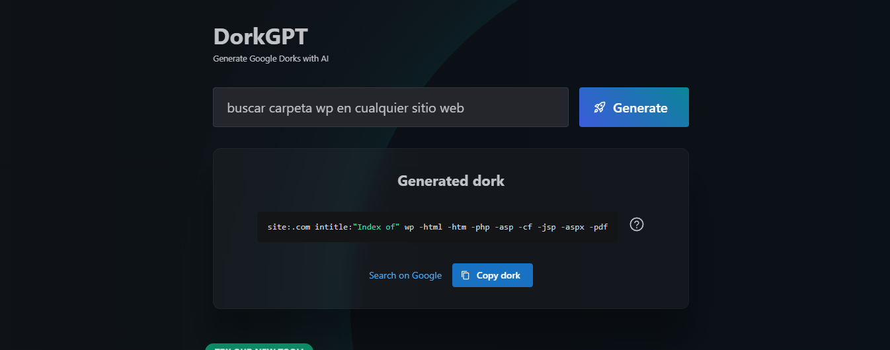

En mi caso estaba interesado en buscar paginas con el backend de Wordpress expuesto. 
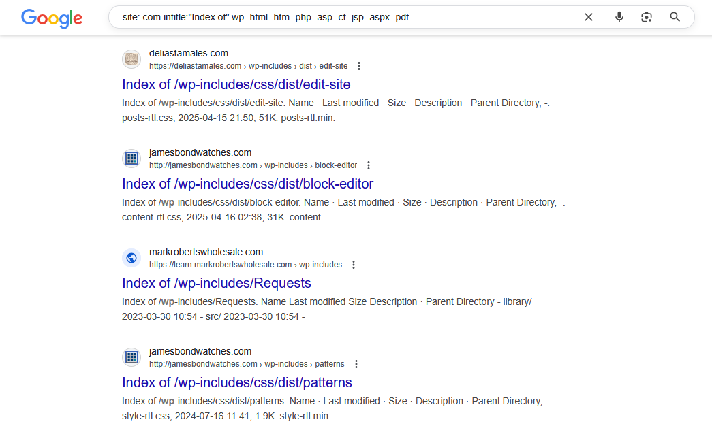

Fui probando hasta que encontré una pagina con la carpeta wp-includes indexada en el buscador.
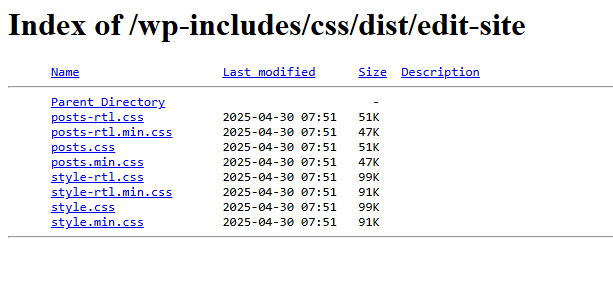

Una vez identificado nuestro objetivo, deduje que si la pagina tenia su carpeta wp-includes indexada en la web, tambien tendria el formulario de wp-login expuesto y asi fue
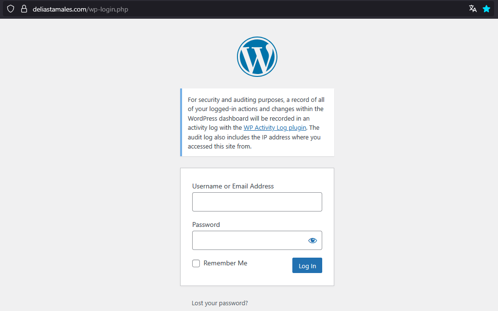

Todavía ni siquiera había accedido a la pagina web y ya podía probar acceder al Wordpress con un ataque de fuerza bruta, con Hydra por ejemplo.
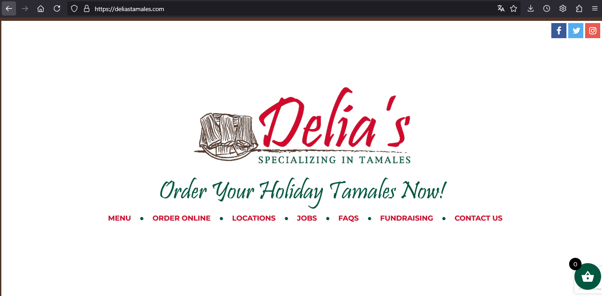

Utilize Wappalyzer para ver las tecnologias con las que la web fue construida y utiliza para su funcionamiento, por ejemplo: Wordpress, Woocommerce, PHP, etc.

También utilice Foca, herramienta de ElevenPaths, para escanear la web en busca de documentos con metadatos e información confidencial, sin embargo, únicamente encontró un menú
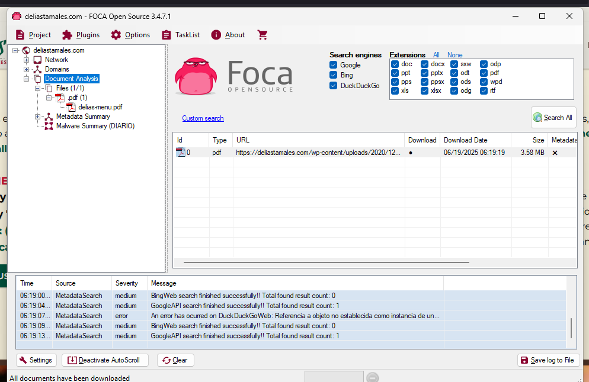

Con DNS Dumpster recopile informacion de los name servers, registros de correo y registros de direccion, construyendo un diagrama visual de la infraestructura DNS
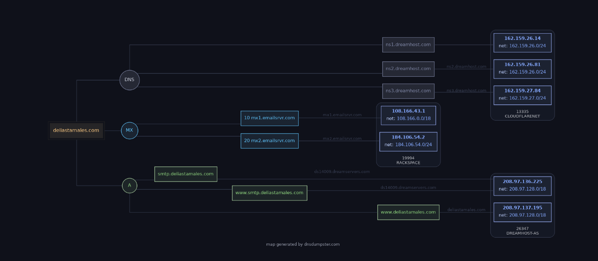

Después utilice Shodan para identificar posibles CVE, ver información del dominio, además de puertos abiertos.
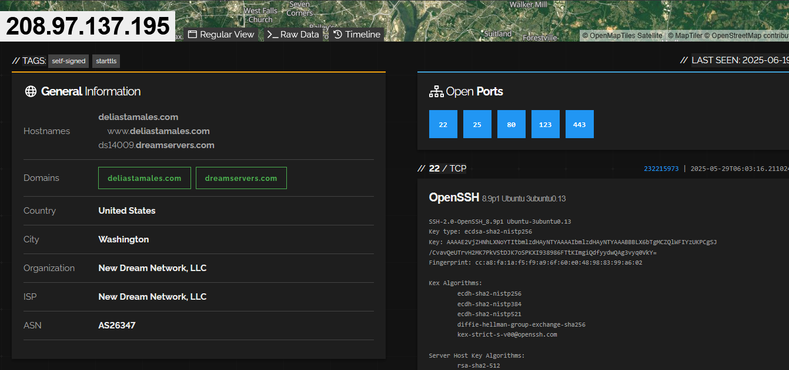
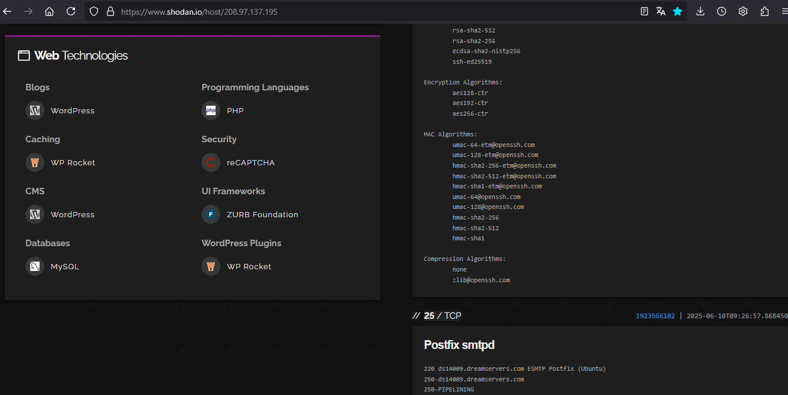

Instale una herramienta llamada WPScan para identificar vulnerabilidades en el Wordpress, como versiones obsoletas y plugins vulnerables. 
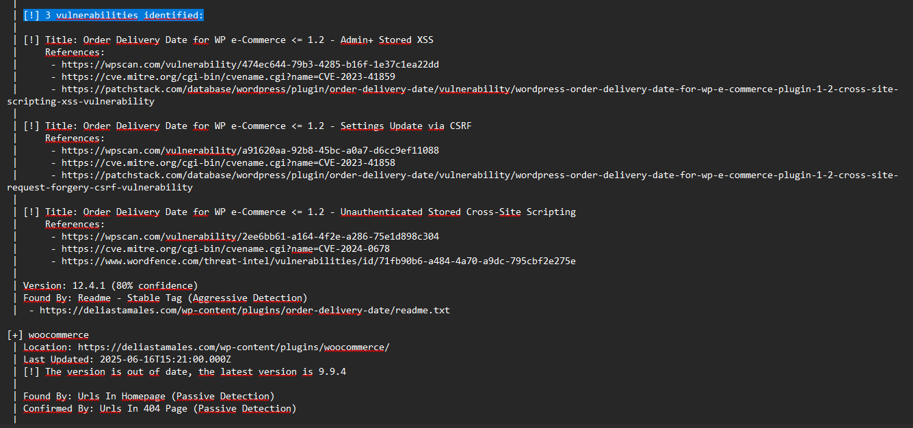

Por ultimo, utilice una herramienta pentesting llamada ZAP OWASP para hacer un rastreo del sitio web, para descubrir todas las URLs, enlaces y formularios accesibles, asi como identificar vulnerabilidades comunes y malas configuraciones
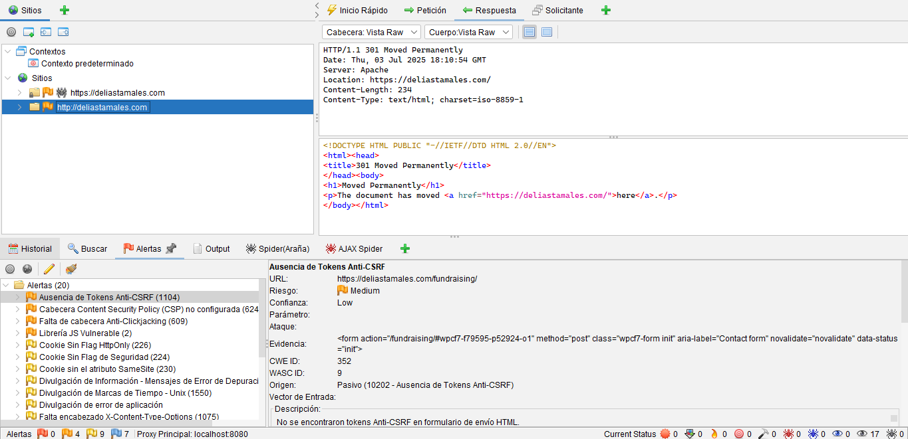
